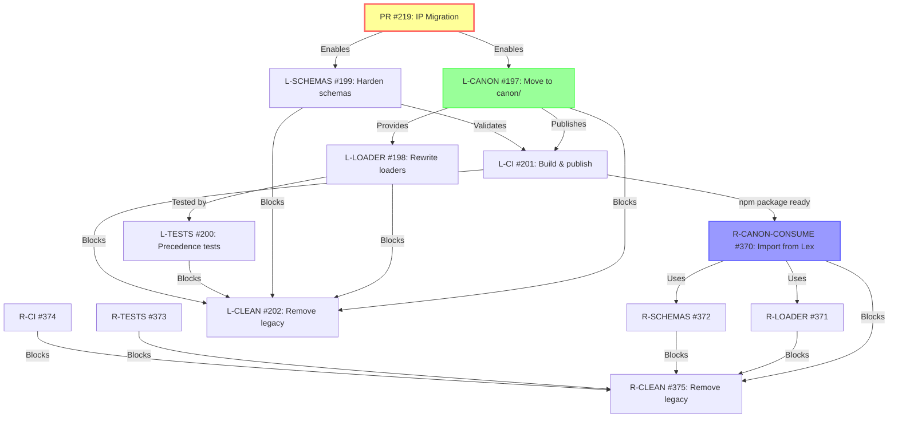

# Epic #196 Correlation: IP Migration as Prerequisite

## Overview

This document explains how **PR #219 (IP Migration: Runner Schemas → lex-pr-runner)** serves as a critical prerequisite for **Epic #196 (Cold Move — Canon assets + precedence)** across both Lex and LexRunner repositories.

---

## Epic #196: The Big Picture

**Goal:** Restructure prompt/schema assets and loader precedence across Lex and LexRunner. Remove ALL legacy code and backward compatibility. This is a **cold move** — no gradual migration, no fallback paths.

**North Star Precedence:**
```
LEX_CANON_DIR → .smartergpt.local/ → package canon
```

**Key Changes:**
- **Source location:** `.smartergpt/` → `canon/` (tracked)
- **Published assets:** `prompts/` and `schemas/` in npm package
- **User overlays:** `.smartergpt.local/` only
- **Environment:** `LEX_CANON_DIR` only (remove legacy vars)
- **Schemas:** `additionalProperties: false`, Zod `.loose()`

---

## How PR #219 Enables Epic #196

### Problem Without PR #219

Before this PR, runner-specific schemas were **duplicated** in the Lex repository:
- `runner.stack.schema.*` (4 variants) — Belonged in lex-pr-runner
- `runner.scope.schema.*` (4 variants) — Belonged in lex-pr-runner
- `execution-plan-v1.*` (4 variants) — Canonical version in lex-pr-runner
- `gates.schema.*` (4 variants) — Shared but duplicated

**Blocker for Epic #196:**
1. **Unclear ownership:** Which schemas belong to which repo?
2. **Cannot publish Lex canon:** Would leak lex-pr-runner IP if published to npm
3. **No single source of truth:** Schemas duplicated across repos
4. **Import chaos:** No clear pattern for cross-repo schema usage

### Solution: PR #219

**Establishes:**
1. ✅ **Clear ownership:** Runner schemas canonical in lex-pr-runner
2. ✅ **Safe Lex publishing:** Lex can publish `canon/` without runner IP
3. ✅ **Single source of truth:** Each schema has one canonical location
4. ✅ **Import pattern:** Package exports enable clean cross-repo imports

**Result:** Unblocks Epic #196's goal of publishing Lex canon assets in npm package.

---

## Dependency Chain



---

## Phase-by-Phase Breakdown

### Phase 0: Prerequisites (PR #219) ✅ COMPLETE

**What:** Migrate runner schemas to lex-pr-runner
**Status:** ✅ MERGED (commits 1ed8df2, 7f7c9e6 in lex-pr-runner; 225d101 in lex)
**Enables:** All Phase 1 and Phase 2 work

**Key Outcomes:**
- ✅ Runner schemas canonical in lex-pr-runner
- ✅ Lex repo clean of runner IP
- ✅ Package exports configured
- ✅ All 123 Lex tests pass (zero regression)
- ✅ Git history cleaned (no leaked IP)

---

### Phase 1: Lex Foundation (Issues #197-#201)

**Goal:** Get Lex to publish canon assets in npm package

#### L-CANON #197: Move tracked assets to `canon/`
**Depends on:** PR #219 ✅
**Status:** Open
**What it does:**
- Move `.smartergpt/prompts/` → `canon/prompts/`
- Move `.smartergpt/schemas/` → `canon/schemas/`
- **Excludes runner IP** (thanks to PR #219)
- Configure build to publish `prompts/` and `schemas/` in package

**Enabled by PR #219:**
- ✅ Lex schemas are now clean (no runner IP)
- ✅ Can safely publish Lex canon without leaking runner schemas
- ✅ Clear ownership allows confident `canon/` restructure

#### L-LOADER #198: Rewrite prompt/schema loaders
**Depends on:** L-CANON #197
**Status:** Open
**What it does:**
- Simplified 3-level precedence: `LEX_CANON_DIR` → `.smartergpt.local/` → package
- Remove legacy env vars (`LEX_PROMPTS_DIR`, `LEX_SCHEMAS_DIR`)
- Import runner schemas from lex-pr-runner package

**Enabled by PR #219:**
- ✅ Clear import pattern: `@guffawaffle/lex-pr-runner/schemas/runner-stack`
- ✅ No confusion about which schemas to load locally vs. from package

#### L-SCHEMAS #199: Harden JSON Schemas
**Depends on:** PR #219 (implicitly)
**Status:** Open
**What it does:**
- Add `$id` to all schemas
- Add `additionalProperties: false` for strict validation
- Replace Zod `.passthrough()` with `.loose()`

**Enabled by PR #219:**
- ✅ Lex-owned schemas clearly identified
- ✅ No risk of hardening runner schemas (they're in lex-pr-runner)

#### L-TESTS #200: Replace precedence tests
**Depends on:** L-LOADER #198
**Status:** Open
**What it does:**
- New tests for 3-level precedence
- Remove legacy tests (old env vars, flat config)

**Enabled by PR #219:**
- ✅ Test imports from lex-pr-runner work correctly
- ✅ Precedence tests can safely exclude runner schemas

#### L-CI #201: Build & publish adjustments
**Depends on:** L-CANON #197, L-SCHEMAS #199
**Status:** Open
**What it does:**
- CI validates schemas with AJV
- Build copies `canon/` → `prompts/` and `schemas/` for publishing
- Determinism checks ensure reproducible builds

**Enabled by PR #219:**
- ✅ Published package will NOT contain runner IP
- ✅ Schema validation won't fail on runner schemas (they're elsewhere)

#### L-CLEAN #202: Remove backward compatibility
**Depends on:** ALL Phase 1 issues
**Status:** Open
**What it does:**
- Remove legacy env vars
- Remove `.smartergpt/` runtime reads
- Remove Zod `.passthrough()`

---

### Phase 2: LexRunner Alignment (Issues #370-#374)

**Goal:** Consume Lex canon and align precedence

#### R-CANON-CONSUME #370: Consume canon from @guffawaffle/lex
**Depends on:** L-CANON #197, L-CI #201 (Lex publishes package)
**Status:** Open
**What it does:**
- Add `@guffawaffle/lex` as dependency
- Import shared schemas (profile, gates) from Lex package
- Remove duplicated schemas

**Enabled by PR #219:**
- ✅ Clear separation: runner schemas stay local, shared schemas from Lex
- ✅ No import collisions (runner schemas already canonical in lex-pr-runner)

#### R-LOADER #371: Align loaders & profile resolution
**Depends on:** R-CANON-CONSUME #370, L-LOADER #198
**Status:** Open
**What it does:**
- Align with Lex's 3-level precedence
- Remove legacy env vars (`LEX_CONFIG_DIR`, `LEXRUNNER_CONFIG_DIR`)
- Use Lex's loaders for shared configs

**Enabled by PR #219:**
- ✅ Runner-specific configs clearly identified (in `.smartergpt.local/runner/`)
- ✅ Shared configs imported from Lex package (post-Epic #196)

#### R-SCHEMAS #372: Align schema usage & typing
**Depends on:** R-CANON-CONSUME #370, L-SCHEMAS #199
**Status:** Open
**What it does:**
- Import shared schemas from Lex
- Add `$id` to runner-only schemas
- Replace Zod `.passthrough()` with `.loose()`

**Enabled by PR #219:**
- ✅ Runner schemas already have `$id` and proper structure
- ✅ Clear delineation: runner-only vs. Lex-imported schemas

#### R-TESTS #373: Replace precedence tests
**Depends on:** R-LOADER #371
**Status:** Open
**What it does:**
- New tests for 3-level precedence
- Runner-specific config tests
- Remove legacy tests

#### R-CI #374: Update workflows
**Depends on:** R-LOADER #371, R-SCHEMAS #372, R-TESTS #373
**Status:** Open
**What it does:**
- Schema validation with AJV
- Precedence behavior tests
- Determinism checks

---

### Phase 3: Cleanup (Issues #202, #375)

**Goal:** Remove ALL legacy code

#### L-CLEAN #202: Lex cleanup
**Depends on:** ALL Lex Phase 1 issues
**Status:** Open

#### R-CLEAN #375: LexRunner cleanup
**Depends on:** ALL LexRunner Phase 2 issues
**Status:** Open

---

## Critical Insights

### Why PR #219 Was Essential

**Without it:**
- ❌ Lex couldn't publish canon (would leak runner IP)
- ❌ No clear schema ownership classification
- ❌ Epic #196 would require complex migration strategy
- ❌ Cross-repo imports would be ambiguous

**With it:**
- ✅ Lex can safely publish canon assets
- ✅ Clear ownership: runner schemas canonical in lex-pr-runner
- ✅ Epic #196 can proceed with confidence
- ✅ Import pattern established: package exports work correctly

### Schema Ownership Matrix (Post-PR #219)

| Schema | Canonical Repo | Lex Uses | lex-pr-runner Uses |
|--------|---------------|----------|-------------------|
| `runner.stack.schema` | lex-pr-runner | ❌ (removed) | ✅ (local) |
| `runner.scope.schema` | lex-pr-runner | ❌ (removed) | ✅ (local) |
| `execution-plan-v1` | lex-pr-runner | ❌ (removed) | ✅ (local) |
| `gates.schema` | Lex | ✅ (local) | ✅ (from Lex pkg*) |
| `profile.schema` | Lex | ✅ (local) | ✅ (from Lex pkg*) |
| `feature-spec-v0` | Lex | ✅ (local) | ❌ |
| `infrastructure` | Lex | ✅ (local) | ❌ |

**\*After Epic #196 completes**

---

## Test Coverage Validation

### PR #219 Verification

**Lex:**
```bash
npm test
# 123/123 tests pass ✅
# Round-trip validation with stricter execution-plan-v1 ✅
# Schema validation with lex-pr-runner imports ✅
```

**lex-pr-runner:**
```bash
npm run build
# ESM + CJS + DTS successful ✅
```

**Cross-repo imports:**
```typescript
// Verified working:
require.resolve('lex-pr-runner/schemas/runner-stack')
require.resolve('lex-pr-runner/schemas/execution-plan-v1')
// Both resolve correctly ✅
```

---

## Timeline Projection

**Completed:**
- ✅ PR #219: IP Migration (November 12, 2025)

**Next Steps:**
1. **L-CANON #197** + **L-SCHEMAS #199** (parallel) — Est. 1 week
2. **L-LOADER #198** — Est. 3-4 days
3. **L-TESTS #200** — Est. 2-3 days
4. **L-CI #201** — Est. 1-2 days
5. **Lex publish v0.5.0** — Breaking release
6. **R-CANON-CONSUME #370** — Est. 2-3 days
7. **R-LOADER #371** + **R-SCHEMAS #372** (parallel) — Est. 1 week
8. **R-TESTS #373** — Est. 2-3 days
9. **R-CI #374** — Est. 1-2 days
10. **L-CLEAN #202** + **R-CLEAN #375** (parallel) — Est. 3-4 days
11. **lex-pr-runner publish v0.2.0** — Breaking release

**Total Epic Duration:** ~4-5 weeks (assuming no blockers)

---

## Success Metrics

### PR #219 Achievements

- ✅ Zero regression (123/123 tests pass)
- ✅ Git history cleaned (no IP leaks)
- ✅ Security documentation created
- ✅ Package exports configured
- ✅ Import patterns established

### Epic #196 Goals (Enabled by PR #219)

- [ ] Lex publishes `prompts/` and `schemas/` in npm package
- [ ] LexRunner imports schemas from Lex package
- [ ] Precedence chain: `LEX_CANON_DIR` → `.smartergpt.local/` → package canon
- [ ] Zero legacy environment variables
- [ ] Zero backward-compatibility code
- [ ] All tests passing (Lex: 356+, LexRunner: 2248+)
- [ ] CI validates schemas and precedence on every push

---

## Related Documentation

- **Epic #196:** [github.com/Guffawaffle/lex/issues/196](https://github.com/Guffawaffle/lex/issues/196)
- **PR #219:** [github.com/Guffawaffle/lex/pull/219](https://github.com/Guffawaffle/lex/pull/219)
- **Security Incident:** `SECURITY_INCIDENT_20251112.md`
- **Prevention Policy:** `SECURITY_POLICY.md`

---

## Conclusion

**PR #219 is the foundation** upon which Epic #196 builds. Without it:
- Lex cannot safely publish canon assets (would leak runner IP)
- Cross-repo schema imports would be ambiguous
- Epic #196 would require complex migration strategy

**With PR #219 complete:**
- ✅ Clear schema ownership established
- ✅ Lex can publish canon without IP concerns
- ✅ Import patterns proven and working
- ✅ Epic #196 can proceed confidently

**Status:** ✅ PREREQUISITE COMPLETE — Epic #196 unblocked and ready to proceed.

---

**Last Updated:** November 12, 2025
**Next Milestone:** L-CANON #197 + L-SCHEMAS #199 (parallel start)
