# Lex Repository — Issue Analysis & Status Report
**Date:** November 22, 2025
**Repo:** @smartergpt/lex
**Current Version:** 0.4.4-alpha (published to npm)
**Test Status:** 123/123 passing ✅
**CI Status:** All checks passing ✅

---

## Executive Summary

### Project Health
- **Overall Status:** 🟢 HEALTHY
- **Latest Release:** v0.4.4-alpha (published Nov 22, 2025)
- **Open Issues:** 10
- **Backlog Status:** Needs reorganization after 0.4.4-alpha security cleanup

### Key Accomplishments (This Session)
✅ Removed all IP references from git history (10 files, 681 commits cleaned)
✅ Moved LexRunner docs to appropriate repository
✅ Published @smartergpt/lex@0.4.4-alpha to npm (265 files, 854.2 kB)
✅ Unpublished 0.4.3-alpha (IP cleanup)
✅ All tests passing (123/123)
✅ All CI checks passing (10/10)

### Action Items for PM
1. ⚠️ **Epic #196 status:** Requires sub-issues to be created/updated (L-CANON, L-LOADER, L-SCHEMAS, L-TESTS, L-CI, L-CLEAN)
2. ⚠️ **Epic #183 status:** Requires cross-repo coordination (Lex + LexRunner)
3. ⚠️ **Release #227 status:** COMPLETED in 0.4.4-alpha; mark as done
4. 📋 **Backlog consolidation:** Multiple epics need prioritization and dependency mapping

---

## Issue Analysis by Category

### 1️⃣ COMPLETED — Ready to Close

#### Issue #227: Release 0.4.0-alpha (Actually 0.4.4-alpha)
- **Status:** ✅ **COMPLETED**
- **Version:** Released as v0.4.4-alpha (not v0.4.0-alpha)
- **What was done:**
  - Package published to npm as `@smartergpt/lex@0.4.4-alpha`
  - All acceptance criteria met (tests, lint, CI, subpath exports)
  - Breaking changes documented
  - GitHub release created with comprehensive release notes
  - Previous version (0.4.3-alpha) unpublished due to IP exposure

**Action:** Update title/description to reflect v0.4.4-alpha and **close issue**.

---

### 2️⃣ ACTIVE EPICS — Require Sub-Issue Updates

#### Epic #196: Cold Move — Canon assets + precedence
- **Status:** 🟡 **IN PROGRESS (Needs Coordination)**
- **Current State:**
  - Created as umbrella for 12 child issues (6 in Lex, 6 in LexRunner)
  - Child issues exist but need to be linked
  - Lex sub-issues: #197, #198, #199, #200, #201, #202
  - LexRunner sub-issues: Not yet created; need cross-repo coordination

**Action Items:**
1. Verify all Lex child issues (#197-#202) exist and are properly linked to #196
2. Create corresponding LexRunner issues (R-CANON-CONSUME, R-LOADER, R-SCHEMAS, R-TESTS, R-CI, R-CLEAN)
3. Link cross-repo dependencies explicitly
4. Update milestone markers: `smartergpt-structure-v1` in both repos

**Recommendation:** Create a separate **cross-repo coordination issue** that tracks sync between both repositories.

---

#### Epic #183: Align `.smartergpt.local` / `.smartergpt` structure
- **Status:** 🟡 **IN PROGRESS (Blocked on Epic #196)**
- **Current State:**
  - Overarching structure epic
  - Depends on #196 for detailed implementation
  - Child issues exist: #184, #185, #186, #187, #188

**Dependency Graph:**
```
Epic #183 (parent)
├── Epic #196 (blocker for implementation)
│   └── L/R-CANON → L/R-LOADER → L/R-SCHEMAS → L/R-TESTS → L/R-CI → L/R-CLEAN
└── Related: #184, #185, #186, #187, #188 (Lex-specific tasks)
```

**Action:** Document blocker relationship in both issue descriptions.

---

### 3️⃣ BACKLOG EPICS — Require Prioritization

#### Epic #78: Frame ingestion & Atlas/Map sync pipeline
- **Status:** 🟤 **BACKLOG (Medium Priority)**
- **Effort:** Large (3-4 weeks)
- **Blockers:** None (can start after 0.4.4 stabilizes)
- **Related PRs:** #72-#77 (rendering, caching, visualization)

**Child Issues Needing Verification:**
- #79: Programmatic Frame ingestion API
- #80: Rebuild Atlas indexes on demand
- #81: Cross-link to existing PR work

**Action:** Move to **milestone 0.5.0** once #196 complete. Start scoping after v0.4.4 stabilizes.

---

#### Epic #237: Production Hardening Roadmap (0.5.0)
- **Status:** 🟤 **BACKLOG (High Priority for Production)**
- **Effort:** Large (10-12 weeks)
- **Target Release:** Q1 2026
- **Components:**
  - P0: Database encryption, OAuth2/JWT, Enhanced audit logging
  - P1: IP whitelisting, Path traversal protection, Security tests, Deployment guide
  - P2: GDPR compliance, Schema validation

**Key Requirements:**
- All P0 items must be done before release
- Requires security review
- Performance benchmarks needed (<10% regression)
- Breaking changes possible

**Action:**
1. Create **milestone 0.5.0**
2. Break down P0 items into concrete GitHub issues:
   - `#237.1: Database encryption with SQLCipher`
   - `#237.2: OAuth2/JWT authentication implementation`
   - `#237.3: Enhanced audit logging with hash chain`
   - `#237.4: IP whitelisting rules engine`
   - etc.
3. Schedule initial scoping for Q4 2025 (January planning)

---

### 4️⃣ ACTIVE MILESTONES — Require Updates

#### Milestone 0.4.0 Kickoff (#157)
- **Status:** 🟢 **TRACKING COMPLETE**
- **Description:** Fanout & Weave merge strategy with 4 gates (G0-G3)
- **Issues Tracked:**
  - Core: #146, #154, #150 (infrastructure)
  - Foundations: #88, #147, #82, #84 (schema, search, aliasing)
  - Features: #79, #80 (ingestion, Atlas)
  - Docs: #148, #149, #83, #85

**Current State:**
- Many of these issues contributed to 0.4.4 release
- Need to verify which are complete and close them

**Action:** Audit each issue in #157 and update status/close if complete.

---

#### Milestone 0.3.0 Post-Release Quality (#151)
- **Status:** 🟡 **PARTIALLY COMPLETE**
- **Open Items:** #146, #147, #148, #149, #150
- **Status:** These were incorporated into 0.4.0 planning; need consolidation

**Action:** Move resolved items to closed, keep active ones in 0.4.0 planning.

---

### 5️⃣ DETAILED ISSUE STATUS

| # | Title | Status | Category | Effort | Blocker | Action |
|---|-------|--------|----------|--------|---------|--------|
| 237 | Production Hardening (0.5.0) | 🟤 Backlog | Epic/Security | XL | None | Break into sub-issues, schedule Q1 2026 |
| 227 | Release 0.4.0-alpha | ✅ Done | Release | — | None | **Close issue** (completed as v0.4.4) |
| 196 | Epic: Cold Move (Canon+Precedence) | 🟡 Active | Epic/Refactor | XL | #197 | Link sub-issues, create LexRunner tasks |
| 198 | L-LOADER: Prompt/Schema loaders | 🟡 Backlog | Refactor | L | #197 | Awaiting #197 completion |
| 197 | L-CANON: Move assets to canon/ | 🟡 Backlog | Refactor | L | None | Start after 0.4.4 stabilizes |
| 199 | L-SCHEMAS: Harden JSON Schemas | 🟡 Backlog | Refactor | M | #197 | Parallel to #198 |
| 200 | L-TESTS: Replace precedence tests | 🟡 Backlog | Tests | M | #198 | Depends on loader rewrite |
| 201 | L-CI: Build & publish adjustments | 🟡 Backlog | CI | M | #197 | Parallel track |
| 202 | L-CLEAN: Remove backward compat | 🟡 Backlog | Refactor | M | All others | Final cleanup pass |
| 183 | Epic: .smartergpt.local alignment | 🟡 Active | Epic/Infrastructure | XL | #196 | Document blocker, coordinate with LR |
| 187 | Environment & token expansion | 🟤 Backlog | Enhancement | M | None | Part of #183 epic |
| 186 | Frames export utility | 🟤 Backlog | Feature | M | #185 | Part of #183 epic |
| 185 | Lex logging & database backups | 🟤 Backlog | Feature | M | None | Part of #183 epic |
| 175 | Phase 3D: FrameStore migration | 🟤 Backlog | Refactor | L | None | Deferred; requires MCP refactor |
| 157 | 0.4.0 Kickoff — Fanout & Weave | 🟡 Active | Milestone | — | #196 | Audit & close completed items |
| 151 | v0.3.0 Post-Release Quality | 🟡 Active | Milestone | — | None | Consolidate with 0.4.0 |
| 78 | Epic C: Frame ingestion & Atlas | 🟤 Backlog | Epic/Feature | L | None | Move to 0.5.0 milestone |

---

## Recommended Actions (Priority Order)

### 🚨 IMMEDIATE (This Week)

1. **Close Issue #227**
   - Update title to reflect v0.4.4-alpha (not v0.4.0-alpha)
   - Add comment confirming completion and release link
   - Close with "✅ Completed"

2. **Update Epic #196 Child Issues**
   - Verify #197-#202 exist in Lex repo
   - Create L-CANON through L-CLEAN issues if missing
   - Link all to parent epic #196
   - Update milestone: `smartergpt-structure-v1`

3. **Create LexRunner Counterpart Issues**
   - File R-CANON-CONSUME, R-LOADER, R-SCHEMAS, R-TESTS, R-CI, R-CLEAN in lex-pr-runner repo
   - Link to parent epic in lex-pr-runner repo (if separate epic exists)
   - Add cross-repo link comments in both sets of issues

### ⚠️ NEAR-TERM (Next Week)

4. **Establish Cross-Repo Coordination**
   - Create tracking issue: "Lex+LexRunner Coordination: Epic #196 Implementation"
   - Document sync points and dependencies
   - Schedule weekly sync if needed

5. **Audit Milestone #157 (0.4.0 Kickoff)**
   - Check each issue (#146, #154, #150, #88, #147, #82, #84, #79, #80, #148, #149, #83, #85)
   - Mark complete if resolved
   - Move in-progress items to 0.5.0 if needed

6. **Create 0.5.0 Milestone & Priority Issues**
   - Establish `0.5.0` milestone in package.json and GitHub milestones
   - Break down Epic #237 (Production Hardening) into 6-8 concrete issues
   - Add to backlog with P0/P1 labels

### 📋 BACKLOG (Next Month)

7. **Consolidate Documentation**
   - Ensure all breaking changes from 0.4.4 are reflected in README
   - Update migration guides if needed
   - Verify all subpath exports are documented

8. **Plan 0.5.0 Sprint**
   - Schedule for Q1 2026 (January)
   - Include database encryption, OAuth2, audit logging
   - Plan for security review

---

## Dependency Graph (Visual)

```mermaid
graph TD
    A["✅ v0.4.4-alpha Released"] -->|completion| B["❌ #227: Close Issue"]
    A -->|foundation| C["🟡 Epic #196: Canon Assets"]

    C -->|sub-issues| C1["#197: L-CANON"]
    C -->|sub-issues| C2["#198: L-LOADER"]
    C -->|sub-issues| C3["#199: L-SCHEMAS"]
    C -->|sub-issues| C4["#200: L-TESTS"]
    C -->|sub-issues| C5["#201: L-CI"]
    C -->|sub-issues| C6["#202: L-CLEAN"]

    C1 --> C2
    C1 --> C3
    C1 --> C5
    C2 --> C4
    C3 --> C4
    C4 --> C6
    C5 --> C6

    C -->|blocks| D["🟡 Epic #183: .smartergpt.local"]

    D -->|includes| E["#187: Token expansion"]
    D -->|includes| F["#186: Frames export"]
    D -->|includes| G["#185: Logging & backups"]

    H["🟤 Epic #237: Production Hardening"] -->|target| I["0.5.0 Release Q1 2026"]

    J["🟤 Epic #78: Frame Ingestion"] -->|awaits| C
    J -->|schedule| I
```



---

## Quality Metrics

| Metric | Current | Target | Status |
|--------|---------|--------|--------|
| **Tests Passing** | 123/123 | 123/123 | ✅ |
| **CI Checks** | 10/10 | 10/10 | ✅ |
| **Open Issues** | 10 | < 5 (post-cleanup) | ⚠️ |
| **Coverage** | Unknown | > 80% | 📊 |
| **Build Determinism** | ✅ | ✅ | ✅ |
| **npm Version** | 0.4.4-alpha | 0.5.0-alpha (Q1 2026) | 📅 |

---

## Communication Plan

### Stakeholders
- **Internal (Lex Team):** Update on 0.5.0 planning
- **LexRunner Team:** Coordinate Epic #196 implementation
- **npm Community:** Alpha warning in README maintained

### Updates Needed
- [ ] Document 0.5.0 milestone and targets
- [ ] Create cross-repo coordination issue
- [ ] Update README with v0.4.4-alpha info (already done via release notes)
- [ ] Schedule 0.5.0 scoping call if needed

---

## Next Steps

1. **This session:** Create actionable issues from backlog
2. **This week:** Close #227, verify #196 child issues, create LexRunner counterparts
3. **Next week:** Audit #157, establish 0.5.0 milestone
4. **Next month:** Plan and scope 0.5.0 development (Q1 2026)

---

*Report generated by PM Agent on 2025-11-22*
*Repository: @smartergpt/lex @ v0.4.4-alpha*
