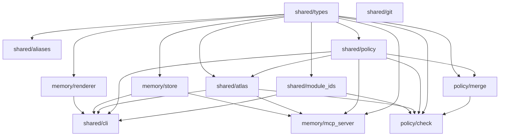

# Lex (MIT) — Atlas/Memory Core


**Policy-aware work continuity with receipts.**

Lex powers the paid **LexRunner** CLI; development stays OSS-first. See the [LexRunner repo](https://github.com/Guffawaffle/lex-pr-runner) for the orchestration layer.

### Lex (MIT OSS) vs LexRunner (Proprietary)

| Aspect | **Lex** (MIT) | **LexRunner** (Paid) |
|--------|---------------|--------------------|
| **Purpose** | Atlas/Memory/Policy core frameworks | Enterprise merge-weave orchestration CLI |
| **License** | MIT (open source) | Proprietary |
| **Repo** | `Guffawaffle/lex` (this repo) | `Guffawaffle/lex-pr-runner` |
| **What you get** | Frames, policy scanners, atlas fold-radius | Full CLI for fanout/merge workflows |

👉 **This repo** (Lex) = OSS primitives for frames, memory, and policy.
👉 **LexRunner** = Orchestration layer built on Lex (paid product).

---

### Local CI (Docker)

Reproduce CI locally without touching GitHub workflows:

```bash
# Quick run via npm
npm run local-ci

# Or run scripts directly:
./scripts/local-ci-run.sh

# (optional) run with no network allowed
npm run local-ci:nonet
# or: ./scripts/ci-nonet.sh

# one-time build (or auto-built by the helper script)
docker build -f ci.Dockerfile -t lex-ci:local .
```

This Docker image is **not** used by GitHub Actions. It exists only for local parity and faster debugging.

---

When you ask `/recall TICKET-123`, you don't get vague summarization or context-free git log replay. You get:

- **What you were doing** — the Frame you captured with `/remember`: which modules you touched, what the blocker was, what the next action is.
- **Why you stopped** — the architectural policy that was in your way: which edge is forbidden, which permission you don't have yet, which feature flag isn't live.
- **The exact neighborhood** — a fold-radius-1 Atlas Frame showing only the modules relevant to your work, not the entire codebase.

This is continuity for humans and assistants working on large systems where "just read the whole repo" doesn't scale and "trust the LLM to figure it out" breaks in prod.

## Core ideas

### Frames (lex/memory)
Frames are timestamped work session snapshots. You create them with `/remember` at meaningful moments ("this button is still disabled because access wiring isn't allowed yet"). A Frame stores:
- a rendered "memory card" image (high-signal logs, diffs, active flags, next step),
- the raw text behind that card,
- structured metadata: branch, blockers, `status_snapshot.next_action`, and `module_scope`.

Frames live locally (e.g. SQLite). No telemetry. No forced HTTP service. Access is via MCP over stdio.

### Policy (lex/policy)
Policy is machine-readable architecture boundaries. `lexmap.policy.json` defines which modules own which code, which calls are allowed, which are forbidden, which permissions/flags gate them, and which kill patterns are being removed. Language scanners ("dumb by design") emit facts from code; `lex check` compares facts vs policy and can fail CI.

### Fold radius & Atlas Frame (lex/shared/atlas)
When you recall a Frame, Lex does **not** dump the whole monolith into context. Instead, it exports an Atlas Frame: the touched modules (`module_scope`) plus their 1-hop neighborhood in the policy graph (allowed callers, forbidden callers, required flags/permissions). That's fold radius = 1.

That gives you and your assistant a "map page," not a firehose.

### THE CRITICAL RULE
Every module name in `module_scope` MUST match a module ID in `lexmap.policy.json`. No ad hoc naming. If the vocabulary drifts, you lose the ability to line up:
- "what happened last night"
with
- "what the architecture is supposed to allow."

This shared vocabulary is what lets Lex answer:
> "You left this button disabled because this module was still calling a forbidden dependency. Your declared next step was to route through the approved service."

**Module ID Validation & Aliasing:** To help prevent typos and improve usability, Lex provides fuzzy matching with helpful suggestions when module IDs don't match. When you use an invalid module ID, you'll get suggestions for similar modules. In the future, explicit alias tables will support team shorthand conventions (e.g., `auth` → `services/auth-core`) and historical renames. See `src/shared/aliases/README.md` for details.

---

## Quickstart

### Installation

```bash
npm install lex
```

### Basic Usage

```typescript
import { saveFrame, searchFrames, getDb, closeDb } from "lex";

// Initialize the database
const db = getDb("./memory.db");

// Capture a work session snapshot
const frame = await saveFrame(db, {
  referencePoint: "implementing user authentication flow",
  summaryCaption: "Added password validation to AuthService",
  statusSnapshot: {
    nextAction: "Wire up permission check before allowing login",
    blockers: ["Need access to PermissionService - forbidden edge in policy"],
  },
  moduleScope: ["services/auth-core", "services/password"],
  branch: "feature/auth-improvements",
  jira: "AUTH-123",
  keywords: ["authentication", "security"],
});

console.log(`Frame captured: ${frame.id}`);

// Later: recall what you were working on
const recalled = await searchFrames(db, {
  referencePoint: "authentication",
  limit: 5,
});

recalled.forEach((f) => {
  console.log(`[${f.branch}] ${f.summaryCaption}`);
  console.log(`  Next: ${f.statusSnapshot.nextAction}`);
});

closeDb(db);
```

### CLI Usage

```bash
# Capture a memory frame
lex remember \
  --jira AUTH-123 \
  --summary "Added password validation to AuthService" \
  --next "Wire up permission check" \
  --modules "services/auth-core,services/password" \
  --blockers "Need access to PermissionService - forbidden edge"

# Recall previous work
lex recall "authentication flow"
lex recall AUTH-123

# Check policy compliance
lex check merged-facts.json lexmap.policy.json
```

**CLI outputs:**
- `lex remember` → Confirmation with Frame ID and summary
- `lex recall` → Matching frames with context (branch, blockers, next action, module neighborhood)
- `lex check` → Policy violations report with forbidden edges, missing permissions, kill pattern matches

See the [RECEIPTS.md](./RECEIPTS.md) for a complete end-to-end walkthrough.

---

## What Are Receipts?

A **receipt** is a human-readable artifact that maps acceptance criteria to the gates that verified them and the outputs those gates produced. Think of it as an audit trail that shows:

- **Input**: What you asked for (feature spec, policy rule, test requirement)
- **Gate**: What automated check ran (policy scanner, test suite, linter)
- **Output**: What the gate found (violations, test results, coverage)
- **Verdict**: Pass/fail + actionable next steps

Receipts appear in:
- **CLI output** (e.g., `lex check` shows which edges are forbidden and why)
- **CI logs** (automated gates produce structured JSON receipts)
- **Atlas Frames** (recalled frames include gate results from when they were captured)

This gives you **continuity with proof**: not just "what happened," but "what was checked, what passed, what failed, and what to do next."

---

## Why TypeScript-Only + NodeNext?

### The Problem
Mixing `.ts` source files with committed `.js` artifacts creates confusion:
- Which `.js` files are hand-written vs. build output?
- Are imports broken because someone edited generated code?
- Do CI checks run against source or compiled artifacts?

### The Solution
**`src/` contains only TypeScript.** All `.js` files are build outputs in `dist/`.

**`NodeNext` module resolution** means:
- Runtime code uses `.js` extensions in imports (`import x from "./foo.js"`)
- TypeScript resolves those imports against `.ts` sources during compilation
- After build, the emitted `.js` files resolve correctly in Node.js

**Why this works:**
1. Single source of truth: `src/` is the canonical code
2. Type safety: TypeScript checks everything before build
3. Runtime correctness: Node ESM import rules work in `dist/`
4. Deterministic builds: `tsc -b` with project references ensures layered, incremental compilation

**CI guards:**
- `scripts/check-no-js-in-src.mjs` fails if any `.js` appears in `src/`
- ESLint enforces `.js` extensions in imports for runtime correctness

See [docs/adr/0001-ts-only-nodenext.md](./docs/adr/0001-ts-only-nodenext.md) for the full decision record.

---

## Status
Early alpha. We are actively converging two previously separate codebases:
- LexBrain (episodic Frames and recall)
- LexMap (policy graph, scanners, CI enforcement)

The goal of this repo is to ship them as one system called **Lex** with one CLI (`lex`), one policy contract, and one recall surface.

## Learn More

- [Overview](./docs/OVERVIEW.md) — the pain, the solution, the moat
- [Mind Palace Guide](./docs/MIND_PALACE.md) — reference points and Atlas Frames for natural recall
- [Architecture Loop](./docs/ARCHITECTURE_LOOP.md) — the full explainability story
- [Adoption Guide](./docs/ADOPTION_GUIDE.md) — how to roll out Lex in phases
- [Limitations](./docs/LIMITATIONS.md) — known constraints and future work

## Source Layout

`src/` is **TypeScript-only**. JavaScript files (`.js`) under `src/` were legacy compiled artifacts and have been removed. Build output is emitted to `dist/` via `tsc -b` (see `package.json` exports). Add new code in `.ts`/`.tsx` only; do not commit generated `.js` siblings.

## Build Graph (Project References)

Lex now uses a **TypeScript solution build** for deterministic layering and parallelizable incremental builds.

### Files

- `tsconfig.base.json` – Shared compiler options (ES2022 target, `NodeNext` resolver, single `dist/` outDir, declarations + source maps).
- `tsconfig.build.json` – Solution file with explicit `references` (no `include` / `files`).

### Rationale

1. Single ESM configuration (`NodeNext`) keeps runtime `.js` specifiers working.
2. Declarations (`.d.ts`) emitted for all subprojects to support downstream tooling.
3. Stable `dist/` layout (no per-package scattered outputs) simplifies exports.
4. References encode dependency order (types → aliases/module_ids → policy/atlas → memory → cli) enabling incremental rebuilds.

### Reference Graph



### Commands

- `npm run build` → `tsc -b tsconfig.build.json`
- `npm run clean` → cleans build graph & removes `dist/`
- `npm run type-check` → `--noEmit` solution validation

Add new subprojects by creating `src/<area>/<name>/tsconfig.json` that `extends" ../../../tsconfig.base.json"` and setting `"composite": true`, then add its path to `tsconfig.build.json` references.

> Runtime Note: Keep import specifiers with explicit `.js` extensions for local relative imports; `NodeNext` maps them to the emitted `.js` outputs while TypeScript resolves against `.ts` sources.
## License

MIT
