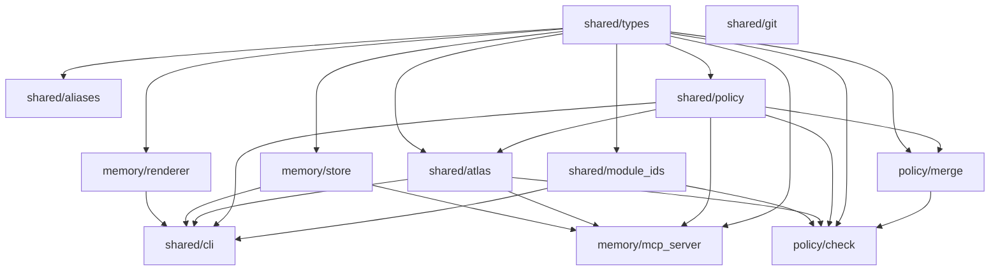

# Lex (MIT) — Atlas/Memory Core


**Policy-aware work continuity with receipts.**

Lex powers the paid **LexRunner** CLI; development stays OSS-first. See the [LexRunner repo](https://github.com/Guffawaffle/lex-pr-runner) for the orchestration layer.

### Lex (MIT OSS) vs LexRunner (Proprietary)

| Aspect | **Lex** (MIT) | **LexRunner** (Paid) |
|--------|---------------|--------------------|
| **Purpose** | Atlas/Memory/Policy core frameworks | Enterprise merge-weave orchestration CLI |
| **License** | MIT (open source) | Proprietary |
| **Repo** | `Guffawaffle/lex` (this repo) | `Guffawaffle/lex-pr-runner` |
| **What you get** | Frames, policy scanners, atlas fold-radius | Full CLI for fanout/merge workflows |

👉 **This repo** (Lex) = OSS primitives for frames, memory, and policy.
👉 **LexRunner** = Orchestration layer built on Lex (paid product).

---

### Local CI (Docker)

Reproduce CI locally without touching GitHub workflows:

```bash
# Quick run via npm
npm run local-ci

# Or run scripts directly:
./scripts/local-ci-run.sh

# (optional) run with no network allowed
npm run local-ci:nonet
# or: ./scripts/ci-nonet.sh

# one-time build (or auto-built by the helper script)
docker build -f ci.Dockerfile -t lex-ci:local .
```

This Docker image is **not** used by GitHub Actions. It exists only for local parity and faster debugging.

---

When you ask `/recall TICKET-123`, you don't get vague summarization or context-free git log replay. You get:

- **What you were doing** — the Frame you captured with `/remember`: which modules you touched, what the blocker was, what the next action is.
- **Why you stopped** — the architectural policy that was in your way: which edge is forbidden, which permission you don't have yet, which feature flag isn't live.
- **The exact neighborhood** — a fold-radius-1 Atlas Frame showing only the modules relevant to your work, not the entire codebase.

This is continuity for humans and assistants working on large systems where "just read the whole repo" doesn't scale and "trust the LLM to figure it out" breaks in prod.

## Core ideas

### Frames (lex/memory)
Frames are timestamped work session snapshots. You create them with `/remember` at meaningful moments ("this button is still disabled because access wiring isn't allowed yet"). A Frame stores:
- a rendered "memory card" image (high-signal logs, diffs, active flags, next step),
- the raw text behind that card,
- structured metadata: branch, blockers, `status_snapshot.next_action`, and `module_scope`.

Frames live locally (e.g. SQLite). No telemetry. No forced HTTP service. Access is via MCP over stdio.

### Policy (lex/policy)
Policy is machine-readable architecture boundaries. The policy file defines which modules own which code, which calls are allowed, which are forbidden, which permissions/flags gate them, and which kill patterns are being removed. Language scanners ("dumb by design") emit facts from code; `lex check` compares facts vs policy and can fail CI.

**Policy File Location:**
- Working file: `.smartergpt.local/lex/lexmap.policy.json` (created by `npm run setup-local`)
- Example template: `src/policy/policy_spec/lexmap.policy.json.example`
- Override via environment: `LEX_POLICY_PATH=/custom/path/policy.json`

**Prompt Templates & Schemas:**
Lex uses a precedence chain for loading prompt templates and includes JSON schemas for configuration validation:
- **Package defaults:** `prompts/` and `schemas/` (published with package, copied from `canon/` during build)
- **Local overlay:** `.smartergpt.local/prompts/` and `.smartergpt.local/schemas/` (untracked, for local customization)
- **Environment override:** `LEX_CANON_DIR=/custom/canon` (highest precedence, loads from `/custom/canon/prompts/` and `/custom/canon/schemas/`)
- **Legacy location:** `.smartergpt/schemas/` (still supported for backward compatibility)

See `DIRECTORY_ALIGNMENT.md` for complete details on directory structure, schema locations, and precedence rules.

### Fold radius & Atlas Frame (lex/shared/atlas)
When you recall a Frame, Lex does **not** dump the whole monolith into context. Instead, it exports an Atlas Frame: the touched modules (`module_scope`) plus their 1-hop neighborhood in the policy graph (allowed callers, forbidden callers, required flags/permissions). That's fold radius = 1.

That gives you and your assistant a "map page," not a firehose.

### THE CRITICAL RULE
Every module name in `module_scope` MUST match a module ID in the policy file (`.smartergpt.local/lex/lexmap.policy.json`). No ad hoc naming. If the vocabulary drifts, you lose the ability to line up:
- "what happened last night"
with
- "what the architecture is supposed to allow."

This shared vocabulary is what lets Lex answer:
> "You left this button disabled because this module was still calling a forbidden dependency. Your declared next step was to route through the approved service."

**Module ID Validation & Aliasing:** To help prevent typos and improve usability, Lex provides fuzzy matching with helpful suggestions when module IDs don't match. When you use an invalid module ID, you'll get suggestions for similar modules. Explicit alias tables support team shorthand conventions (e.g., `auth` → `services/auth-core`) and historical renames. See `src/shared/aliases/README.md` for implementation details, or `docs/LEXRUNNER_ALIASING.md` for LexRunner integration patterns.

---

## Quickstart

### Installation

```bash
npm install @guffawaffle/lex

# Initialize working files (creates .smartergpt.local/lex/ with policy and DB)
npm run setup-local
```

The package includes:
- **`prompts/`**: Default prompt templates (customizable via `.smartergpt.local/prompts/`)
- **`schemas/`**: JSON Schemas for validation (customizable via `.smartergpt.local/schemas/`)
- **`dist/`**: Compiled TypeScript modules

#### Customizing Prompts/Schemas

1. **Local overlay:** Create `.smartergpt.local/prompts/` or `.smartergpt.local/schemas/` to override defaults
2. **Environment override:** Set `LEX_PROMPTS_DIR=/custom/prompts` and/or `LEX_SCHEMAS_DIR=/custom/schemas` (highest precedence)

**Precedence chain:** `LEX_PROMPTS_DIR`/`LEX_SCHEMAS_DIR` → `.smartergpt.local/` → package defaults

### Quick Start

Here's the complete workflow from creating a Frame to recalling it and viewing your timeline:

#### 1. Create a Frame

```bash
lex remember \
  --reference-point "Implementing user authentication" \
  --summary "Added login form and JWT validation" \
  --next "Wire up password reset flow" \
  --modules "ui/login,services/auth" \
  --keywords "auth,security"
```

#### 2. Recall It Later

```bash
# Search by keyword
lex recall "authentication"

# Search by ticket
lex recall "TICKET-123"

# JSON output
lex recall "auth" --json
```

#### 3. View Timeline

```bash
# For current branch
lex timeline main

# For a ticket
lex timeline TICKET-123

# With date range
lex timeline main --since "2025-11-01"
```

See [RECEIPTS.md](./RECEIPTS.md) for a detailed walkthrough.

### Basic Usage

```typescript
import { saveFrame, searchFrames, getDb, closeDb } from "lex";

// Initialize the database
const db = getDb("./memory.db");

// Capture a work session snapshot
const frame = await saveFrame(db, {
  referencePoint: "implementing user authentication flow",
  summaryCaption: "Added password validation to AuthService",
  statusSnapshot: {
    nextAction: "Wire up permission check before allowing login",
    blockers: ["Need access to PermissionService - forbidden edge in policy"],
  },
  moduleScope: ["services/auth-core", "services/password"],
  branch: "feature/auth-improvements",
  jira: "AUTH-123",
  keywords: ["authentication", "security"],
});

console.log(`Frame captured: ${frame.id}`);

// Later: recall what you were working on
const recalled = await searchFrames(db, {
  referencePoint: "authentication",
  limit: 5,
});

recalled.forEach((f) => {
  console.log(`[${f.branch}] ${f.summaryCaption}`);
  console.log(`  Next: ${f.statusSnapshot.nextAction}`);
});

closeDb(db);
```

### CLI Output

The Lex CLI provides two output modes for different use cases:

- **Plain Mode** (default): Human-readable with colors and symbols (`✔`, `⚠`, `✖`)
- **JSONL Mode**: Machine-readable events for automation and monitoring

```bash
# Human-readable output (default)
lex remember --reference "test" --caption "test"
# ✔ Frame created successfully!
#   Frame ID: 550e8400-e29b-41d4-a716-446655440000
#   Timestamp: 2025-01-09T12:34:56.789Z

# Machine-readable JSONL output
LEX_CLI_OUTPUT_MODE=jsonl lex remember --reference "test" --caption "test"
# {"v":1,"ts":"2025-01-09T12:34:56.789Z","level":"success","message":"Frame created successfully!","data":{...}}
```

**Key Features:**
- **Dual sinks**: Output goes to both console (for users) and optional diagnostic logger (pino)
- **Stream routing**: Errors/warnings to stderr, info/success/debug to stdout
- **Parseable events**: JSONL mode outputs [CliEvent v1](./schemas/cli-output.v1.schema.json) structures
- **Type-safe**: Full TypeScript types available via `lex/cli-output` subpath export

See [docs/CLI_OUTPUT.md](./docs/CLI_OUTPUT.md) for complete documentation, examples, and consumer integration guide.

### CLI Usage

```bash
# Capture a memory frame
lex remember \
  --jira AUTH-123 \
  --summary "Added password validation to AuthService" \
  --next "Wire up permission check" \
  --modules "services/auth-core,services/password" \
  --blockers "Need access to PermissionService - forbidden edge"

# Recall previous work
lex recall "authentication flow"
lex recall AUTH-123

# Check policy compliance (uses .smartergpt.local/lex/lexmap.policy.json by default)
lex check merged-facts.json

# Or specify custom policy path
lex check merged-facts.json --policy /path/to/custom-policy.json
```

**CLI outputs:**
- `lex remember` → Confirmation with Frame ID and summary
- `lex recall` → Matching frames with context (branch, blockers, next action, module neighborhood)
- `lex check` → Policy violations report with forbidden edges, missing permissions, kill pattern matches

See the [RECEIPTS.md](./RECEIPTS.md) for a complete end-to-end walkthrough.

### Environment Variables

Lex respects the following environment variables for configuration:

- **`LEX_LOG_LEVEL`** - Set log verbosity (`silent`, `trace`, `debug`, `info`, `warn`, `error`, `fatal`). Defaults to `silent` in tests, `info` otherwise.
- **`LEX_LOG_PRETTY`** - Enable pretty-printed logs (`1` for enabled). Auto-enabled when output is a TTY.
- **`LEX_POLICY_PATH`** - Override default policy file location (defaults to `.smartergpt.local/lex/lexmap.policy.json`).
- **`LEX_DEFAULT_BRANCH`** - Override auto-detected default branch for frame operations.

Example:
```bash
# Run with debug logging
LEX_LOG_LEVEL=debug lex recall "authentication"

# Pretty logs in non-TTY environments (CI, scripts)
LEX_LOG_PRETTY=1 npm test

# Use custom policy file
LEX_POLICY_PATH=/custom/policy.json lex check facts.json
```

### Subpath Exports

Lex provides multiple entry points for different functionality. All subpath imports are fully typed with TypeScript declarations.

#### Main Entry Point

The main entry exports core frame storage operations:

```typescript
import { saveFrame, getDb, closeDb, searchFrames, getFrameById } from 'lex';

// Initialize database
const db = getDb('./memory.db');

// Save a frame
await saveFrame(db, {
  referencePoint: 'authentication flow',
  summaryCaption: 'Added password validation',
  // ... other frame properties
});

// Search frames
const results = await searchFrames(db, { referencePoint: 'authentication' });

closeDb(db);
```

**Available exports:**
- `getDb(path?)` - Get/create database connection
- `closeDb(db?)` - Close database connection
- `saveFrame(db, frame)` - Save a new frame
- `getFrameById(db, id)` - Retrieve frame by ID
- `searchFrames(db, query)` - Search frames by query

#### CLI Entry Point

Programmatic access to CLI functionality:

```typescript
import { createProgram, run } from 'lex/cli';

// Create CLI program instance
const program = createProgram();

// Run with custom arguments
await run(['node', 'lex', 'remember', '--jira', 'AUTH-123']);
```

**Available exports:**
- `createProgram()` - Create Commander.js program instance
- `run(argv?)` - Execute CLI with arguments

#### Memory Store

Direct access to frame storage operations (same as main entry):

```typescript
import { getDb, saveFrame, searchFrames } from 'lex/memory/store';

const db = getDb();
const frame = await getFrameById(db, 'frame-id');
```

**Available exports:**
- All frame storage operations: `saveFrame`, `getFrameById`, `searchFrames`, `getFramesByBranch`, `getFramesByJira`, `getFramesByModuleScope`, `getAllFrames`, `deleteFrame`, `getFrameCount`
- Database operations: `getDb`, `closeDb`, `createDatabase`, `getDefaultDbPath`

#### Policy Utilities

Load and work with policy files:

```typescript
import { loadPolicy, clearPolicyCache } from 'lex/shared/policy';

// Load policy from default or custom path
const policy = loadPolicy(); // Uses LEX_POLICY_PATH env or default
const customPolicy = loadPolicy('/path/to/policy.json');

// Clear cache if needed
clearPolicyCache();
```

**Available exports:**
- `loadPolicy(path?)` - Load policy file with caching
- `clearPolicyCache()` - Clear policy cache

#### Atlas Frame Generation

Generate policy-aware spatial neighborhoods:

```typescript
import {
  generateAtlasFrame,
  buildPolicyGraph,
  computeFoldRadius
} from 'lex/shared/atlas';

// Load policy first
import { loadPolicy } from 'lex/shared/policy';
const policy = loadPolicy();

// Build graph from policy
const graph = buildPolicyGraph(policy);

// Generate atlas frame for specific modules
const atlasFrame = generateAtlasFrame({
  policy,
  graph,
  moduleScope: ['services/auth-core', 'services/password'],
  foldRadius: 1
});

console.log(atlasFrame.modules); // Module details with permissions, flags
console.log(atlasFrame.edges);   // Allowed/forbidden caller relationships
```

**Available exports:**
- `generateAtlasFrame(options)` - Generate atlas frame with fold radius
- `buildPolicyGraph(policy)` - Build graph from policy
- `getNeighbors(graph, moduleId, radius)` - Get neighboring modules
- `computeFoldRadius(options)` - Compute fold radius neighbors
- `estimateTokens(atlasFrame)` - Estimate token count
- `autoTuneRadius(options)` - Auto-tune radius for token limits
- Cache utilities: `getCache`, `setEnableCache`, `resetCache`, `getCacheStats`

#### Shared Utilities

Additional utility modules available:

```typescript
// Module ID validation and fuzzy matching
import { validateModuleIds, fuzzyMatchModule } from 'lex/shared/module_ids';

// Module alias resolution
import { resolveAlias, loadAliases } from 'lex/shared/aliases';

// Git branch utilities
import { getCurrentBranch } from 'lex/shared/git';

// Type definitions
import type { Policy, Frame, AtlasFrame } from 'lex/shared/types';
```

**Package structure:**
- `lex/shared/module_ids` - Module ID validation and fuzzy matching
- `lex/shared/aliases` - Module alias resolution
- `lex/shared/git` - Git branch detection
- `lex/shared/types` - TypeScript type definitions

#### Policy CLI Scripts

The policy checker and merge tools are available as CLI scripts but not as importable library functions. Use them via command line:

```bash
# Check policy violations
lex check merged-facts.json

# For direct script access (if needed):
node node_modules/lex/dist/policy/check/lexmap-check.js merged.json policy.json
node node_modules/lex/dist/policy/merge/lexmap-merge.js scan1.json scan2.json
```

---

## What Are Receipts?

A **receipt** is a human-readable artifact that maps acceptance criteria to the gates that verified them and the outputs those gates produced. Think of it as an audit trail that shows:

- **Input**: What you asked for (feature spec, policy rule, test requirement)
- **Gate**: What automated check ran (policy scanner, test suite, linter)
- **Output**: What the gate found (violations, test results, coverage)
- **Verdict**: Pass/fail + actionable next steps

Receipts appear in:
- **CLI output** (e.g., `lex check` shows which edges are forbidden and why)
- **CI logs** (automated gates produce structured JSON receipts)
- **Atlas Frames** (recalled frames include gate results from when they were captured)

This gives you **continuity with proof**: not just "what happened," but "what was checked, what passed, what failed, and what to do next."

---

## Why TypeScript-Only + NodeNext?

### The Problem
Mixing `.ts` source files with committed `.js` artifacts creates confusion:
- Which `.js` files are hand-written vs. build output?
- Are imports broken because someone edited generated code?
- Do CI checks run against source or compiled artifacts?

### The Solution
**`src/` contains only TypeScript.** All `.js` files are build outputs in `dist/`.

**`NodeNext` module resolution** means:
- Runtime code uses `.js` extensions in imports (`import x from "./foo.js"`)
- TypeScript resolves those imports against `.ts` sources during compilation
- After build, the emitted `.js` files resolve correctly in Node.js

**Why this works:**
1. Single source of truth: `src/` is the canonical code
2. Type safety: TypeScript checks everything before build
3. Runtime correctness: Node ESM import rules work in `dist/`
4. Deterministic builds: `tsc -b` with project references ensures layered, incremental compilation

**CI guards:**
- `scripts/check-no-js-in-src.mjs` fails if any `.js` appears in `src/`
- ESLint enforces `.js` extensions in imports for runtime correctness

See [docs/adr/0001-ts-only-nodenext.md](./docs/adr/0001-ts-only-nodenext.md) for the full decision record.

---

## Status
Early alpha. We are actively converging two previously separate codebases:
- LexBrain (episodic Frames and recall)
- LexMap (policy graph, scanners, CI enforcement)

The goal of this repo is to ship them as one system called **Lex** with one CLI (`lex`), one policy contract, and one recall surface.

## Learn More

- [Overview](./docs/OVERVIEW.md) — the pain, the solution, the moat
- [Mind Palace Guide](./docs/MIND_PALACE.md) — reference points and Atlas Frames for natural recall
- [Architecture Loop](./docs/ARCHITECTURE_LOOP.md) — the full explainability story
- [Adoption Guide](./docs/ADOPTION_GUIDE.md) — how to roll out Lex in phases
- [Limitations](./docs/LIMITATIONS.md) — known constraints and future work
- [Epic C Overlap Analysis](./docs/EPIC_C_OVERLAP.md) — coordination with existing PRs #72-#77

## Source Layout

`src/` is **TypeScript-only**. JavaScript files (`.js`) under `src/` were legacy compiled artifacts and have been removed. Build output is emitted to `dist/` via `tsc -b` (see `package.json` exports). Add new code in `.ts`/`.tsx` only; do not commit generated `.js` siblings.

## Build Graph (Project References)

Lex now uses a **TypeScript solution build** for deterministic layering and parallelizable incremental builds.

### Files

- `tsconfig.base.json` – Shared compiler options (ES2022 target, `NodeNext` resolver, single `dist/` outDir, declarations + source maps).
- `tsconfig.build.json` – Solution file with explicit `references` (no `include` / `files`).

### Rationale

1. Single ESM configuration (`NodeNext`) keeps runtime `.js` specifiers working.
2. Declarations (`.d.ts`) emitted for all subprojects to support downstream tooling.
3. Stable `dist/` layout (no per-package scattered outputs) simplifies exports.
4. References encode dependency order (types → aliases/module_ids → policy/atlas → memory → cli) enabling incremental rebuilds.

### Reference Graph



### Commands

- `npm run build` → `tsc -b tsconfig.build.json`
- `npm run clean` → cleans build graph & removes `dist/`
- `npm run type-check` → `--noEmit` solution validation

Add new subprojects by creating `src/<area>/<name>/tsconfig.json` that `extends" ../../../tsconfig.base.json"` and setting `"composite": true`, then add its path to `tsconfig.build.json` references.

> Runtime Note: Keep import specifiers with explicit `.js` extensions for local relative imports; `NodeNext` maps them to the emitted `.js` outputs while TypeScript resolves against `.ts` sources.
## License

MIT
