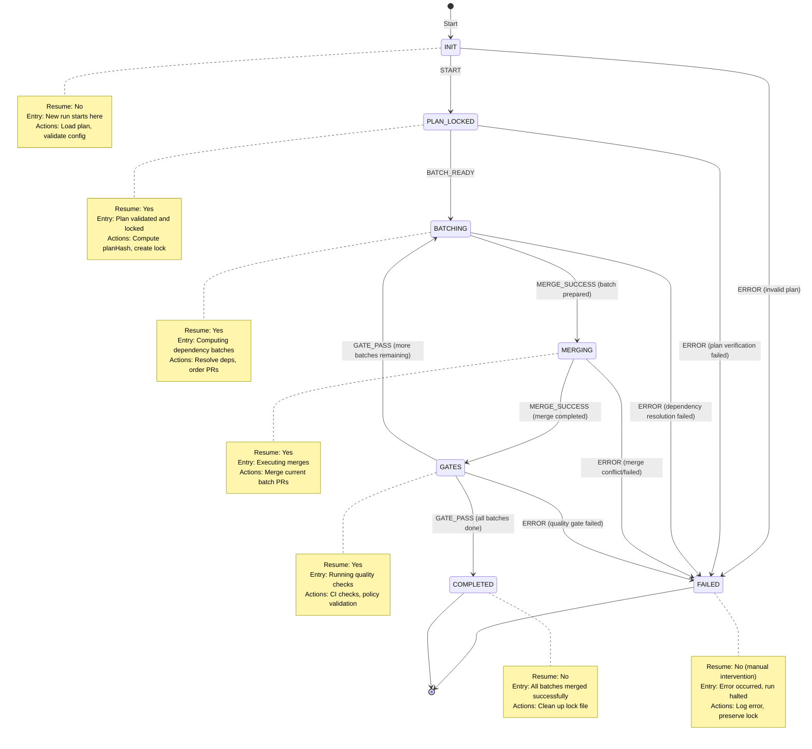

# Merge-Weave State Machine

## Overview

The merge-weave state machine defines the execution flow for orchestrating multiple PR merges with dependency awareness, batch processing, and quality gates. This document describes the states, transitions, error handling, and resume capabilities.

## State Diagram



## State Definitions

### INIT
**Initial State**
- **Purpose**: Entry point for new merge-weave runs
- **Actions**:
  - Load execution plan from file
  - Validate configuration
  - Check prerequisites (repo clean, auth)
- **Transitions**:
  - `START` → `PLAN_LOCKED`: Plan validated successfully
  - `ERROR` → `FAILED`: Invalid plan or configuration
- **Resumable**: No (this is the starting point)

### PLAN_LOCKED
**Plan Validation Complete**
- **Purpose**: Plan is validated and locked with hash for integrity
- **Actions**:
  - Compute `planHash` from plan.json + PR head commits
  - Create `weave-lock.json` with runId and initial state
  - Record plan snapshot
- **Transitions**:
  - `BATCH_READY` → `BATCHING`: Lock created, ready to batch
  - `ERROR` → `FAILED`: Plan hash computation or lock creation failed
- **Resumable**: Yes (can restart from locked plan)

### BATCHING
**Dependency Resolution and Batch Creation**
- **Purpose**: Organize PRs into batches based on dependencies
- **Actions**:
  - Analyze PR dependencies
  - Create ordered batches (topological sort)
  - Update progress tracking
- **Transitions**:
  - `MERGE_SUCCESS` → `MERGING`: Batches ready, start merging
  - `ERROR` → `FAILED`: Circular dependencies or resolution failure
- **Resumable**: Yes (can recompute batches from current progress)

### MERGING
**Executing Merge Operations**
- **Purpose**: Merge PRs in the current batch
- **Actions**:
  - Merge PRs in current batch sequentially or in parallel
  - Update merge status
  - Track completed PRs in progress
- **Transitions**:
  - `MERGE_SUCCESS` → `GATES`: Batch merged successfully
  - `ERROR` → `FAILED`: Merge conflict or merge failure
- **Resumable**: Yes (skip completed PRs, continue from current)

### GATES
**Quality Gate Validation**
- **Purpose**: Run quality checks after merging a batch
- **Actions**:
  - Run CI/CD checks
  - Validate policy compliance
  - Check test results
  - Determine if more batches remain
- **Transitions**:
  - `GATE_PASS` → `BATCHING`: Gates passed, more batches remaining
  - `GATE_PASS` → `COMPLETED`: Gates passed, all batches complete
  - `ERROR` → `FAILED`: Quality gate failed
- **Resumable**: Yes (can re-run gates from last batch)

### COMPLETED
**Terminal State - Success**
- **Purpose**: All batches merged and validated successfully
- **Actions**:
  - Clean up lock file
  - Generate completion report
  - Record final state
- **Transitions**: None (terminal state)
- **Resumable**: No (run completed)

### FAILED
**Terminal State - Error**
- **Purpose**: Run failed and requires manual intervention
- **Actions**:
  - Log error details
  - Preserve lock file for debugging
  - Generate failure report
- **Transitions**: None (terminal state)
- **Resumable**: No (manual fix required, then restart with `--resume`)

## State Transitions

| Current State | Event | Next State | Condition |
|--------------|-------|------------|-----------|
| INIT | START | PLAN_LOCKED | Plan valid |
| INIT | ERROR | FAILED | Invalid plan/config |
| PLAN_LOCKED | BATCH_READY | BATCHING | Lock created |
| PLAN_LOCKED | ERROR | FAILED | Lock creation failed |
| BATCHING | MERGE_SUCCESS | MERGING | Batches ready |
| BATCHING | ERROR | FAILED | Dependency error |
| MERGING | MERGE_SUCCESS | GATES | Batch merged |
| MERGING | ERROR | FAILED | Merge failed |
| GATES | GATE_PASS | BATCHING | More batches remain |
| GATES | GATE_PASS | COMPLETED | All batches done |
| GATES | ERROR | FAILED | Gate failed |

## Resume Entry Points

When resuming with `--resume <runId>`, the system:

1. **Reads** `weave-lock.json`
2. **Verifies** `planHash` matches current plan + PR heads
3. **Re-enters** at the saved state:
   - `PLAN_LOCKED`: Restart batching from scratch
   - `BATCHING`: Recompute batches with current progress
   - `MERGING`: Skip completed PRs, continue current batch
   - `GATES`: Re-run quality gates for current batch

**Non-resumable states**:
- `INIT`: Not saved (ephemeral entry state)
- `COMPLETED`: Run finished (no need to resume)
- `FAILED`: Requires manual intervention before restarting

## Error Handling

Each state handles errors differently:

- **Validation errors** (INIT, PLAN_LOCKED): Fail fast with clear message
- **Dependency errors** (BATCHING): Preserve progress, allow investigation
- **Merge errors** (MERGING): Log conflict details, preserve lock for resume
- **Gate errors** (GATES): Allow retry after CI fixes

## Dry-Run Mode

When `--dry-run` is specified:

- **States traversed**: INIT → PLAN_LOCKED → BATCHING → (stop)
- **Actions performed**:
  - Load and validate plan
  - Compute batches and dependencies
  - Print planned execution order
  - Show dependency graph
  - Estimate token budget
- **Actions skipped**:
  - No lock file creation
  - No actual merges
  - No state persistence

## Lock File Format

```json
{
  "runId": "lexrunner-20251110-abc123",
  "planHash": "sha256:7f8c9d2a1b4e5c3f",
  "state": "MERGING",
  "lastTransition": "2025-11-10T08:30:00.000Z",
  "progress": {
    "completed": ["PR-123", "PR-456"],
    "current": "PR-789",
    "remaining": ["PR-101", "PR-202"]
  }
}
```

## Design Principles

1. **Explicit states**: Each state has clear entry/exit conditions
2. **Resumability**: Most states can be resumed after interruption
3. **Idempotency**: Re-entering a state produces same result
4. **Plan integrity**: Hash verification ensures plan hasn't changed
5. **Progress tracking**: Completed work is never repeated
6. **Error transparency**: Failed states preserve context for debugging

## Related Types

See `src/merge-weave/types.ts` for TypeScript type definitions:
- `WeaveState`: State enumeration
- `WeaveEvent`: Event enumeration
- `WeaveLock`: Lock file structure
- `WeaveProgress`: Progress tracking structure
